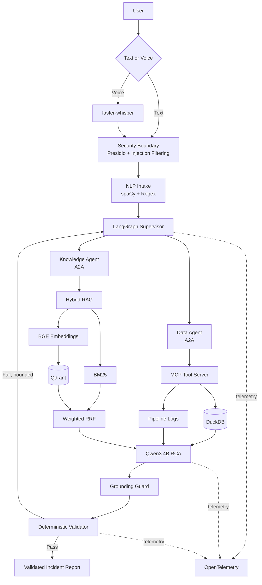

# DataOps Sentinel AI

**Autonomous Multi-Agent Data & BI Incident Investigation Platform**

DataOps Sentinel AI is a production-style AI engineering project that investigates data-pipeline and BI incidents using a distributed, evidence-grounded multi-agent architecture.

A user can report an incident in text or voice — for example:

> "Our executive Sales KPI dashboard dropped significantly today. Investigate what happened and recommend what we should do."

The system sanitizes the input, classifies the incident, delegates evidence collection to specialist agents, retrieves operational knowledge, synthesizes a root-cause analysis with a local LLM, and deterministically validates critical facts before accepting the result.

---

## Highlights

- **LangGraph** for stateful orchestration, parallel fan-out/fan-in, bounded retry, and validation routing
- **A2A** for communication with independently hosted specialist agents
- **MCP** for standardized read-only access to database and pipeline-log tools
- **Hybrid RAG** using BGE embeddings + BM25 + weighted Reciprocal Rank Fusion
- **Qdrant** as the vector database
- **Qwen3 4B via Ollama** for local evidence-grounded synthesis
- **Deterministic grounding and validation** instead of LLM self-reported confidence
- **Presidio** for PII detection/anonymization
- **spaCy + regex** for deterministic NLP routing and technical-entity extraction
- **faster-whisper** for local speech-to-text
- **OpenTelemetry** for per-node latency and execution tracing
- **FastAPI + Streamlit** for API and operations-console interfaces
- **Docker Compose** for service isolation and reproducible deployment
- **Pytest + GitHub Actions** for automated quality checks
- **Graceful degradation** when remote specialist services are unavailable

---

## Architecture



---

## Demo Incident

The synthetic enterprise dataset contains a controlled DataOps incident:

- Previous loaded rows: **13,521**
- Expected rows: **13,521**
- Loaded rows: **9,843**
- Rejected rows: **3,678**
- Root cause: `employee_id` becomes `NULL` during the employee-mapping transformation
- Downstream effect: Sales KPI dashboard drops because the warehouse receives fewer valid rows

The system must independently correlate database evidence, ETL logs, and retrieved operational knowledge before validating the conclusion.

---

## Production Evaluation

The deployed production path was evaluated through:

`FastAPI → LangGraph → A2A → MCP/RAG → Qwen3 → Validator`

Results on the current **8-case regression suite**:

| Metric | Result |
|---|---:|
| Routing accuracy | **100%** |
| Fact accuracy | **100%** |
| Retrieval hit rate | **100%** |
| Citation validity | **100%** |
| Validation pass rate | **100%** |
| Security-control accuracy | **100%** |
| PII leak rate | **0%** |
| Average end-to-end latency | **18.45 s** |
| P95 latency | **28.14 s** |

The suite contains six incident scenarios plus out-of-scope, PII, and prompt-injection coverage. These results describe the current regression dataset and are not a claim of universal model accuracy.

Run it with:

```powershell
python scripts/evaluate_phase5.py
```

---

## Performance Findings

Per-node OpenTelemetry tracing identified local LLM inference as the dominant latency source.

A Qwen3 4B benchmark showed:

| Model | Context | Avg. isolated latency | Critical facts preserved |
|---|---:|---:|---:|
| Qwen3 4B | 4096 | ~19.13 s | Yes |
| Qwen3 4B | 8192 | ~130.91 s | Yes |

The production configuration therefore uses:

```env
OLLAMA_MODEL=qwen3:4b
OLLAMA_NUM_CTX=4096
RAG_TOP_K=3
```

The choice was based on measured latency and factual preservation rather than model size alone.

---

## Technology Stack

| Layer | Technology |
|---|---|
| Workflow orchestration | LangGraph |
| Agent interoperability | A2A |
| Tool interoperability | MCP |
| LLM | Qwen3 4B |
| Local model runtime | Ollama |
| Embeddings | BAAI/bge-small-en-v1.5 |
| Dense vector search | Qdrant |
| Lexical retrieval | BM25 |
| Rank fusion | Weighted Reciprocal Rank Fusion |
| API | FastAPI |
| UI | Streamlit |
| Operational database | DuckDB |
| NLP | spaCy + regex |
| PII protection | Microsoft Presidio |
| Speech recognition | faster-whisper |
| Observability | OpenTelemetry |
| Testing | pytest |
| CI | GitHub Actions |
| Runtime | Docker Compose |

---

## Quick Start — Windows + Host Ollama

### Prerequisites

- Python 3.12
- Docker Desktop
- Ollama

Pull the local model:

```powershell
ollama pull qwen3:4b
```

Start the complete stack while reusing Windows Ollama:

```powershell
docker compose -f compose.host-ollama.yaml up -d --build
```

Check service health:

```powershell
docker compose -f compose.host-ollama.yaml ps
```

Open:

- Streamlit: `http://localhost:8501`
- FastAPI Swagger: `http://localhost:8000/docs`
- Dependency health: `http://localhost:8000/health/dependencies`
- Qdrant dashboard: `http://localhost:6333/dashboard`

---

## Production Smoke Test

With the stack running:

```powershell
python scripts/smoke_test_stack.py
```

Expected result:

```text
Production stack smoke test PASSED
```

---

## Automated Tests

Unit tests do not require live A2A/MCP/Ollama infrastructure:

```powershell
pytest -m "not integration" -v
```

Current local result:

```text
8 passed, 1 deselected
```

The end-to-end demo test is explicitly marked as an integration test.

---

## Graceful Degradation

The system does not crash simply because a specialist agent is unavailable.

For example:

```powershell
docker compose -f compose.host-ollama.yaml stop knowledge-agent
```

The graph continues with available live evidence, records the missing service, lowers confidence, and prevents an insufficiently supported answer from being marked fully validated.

Restart:

```powershell
docker compose -f compose.host-ollama.yaml start knowledge-agent
```

---

## Hallucination Controls

The project does not rely on a single prompt such as "do not hallucinate."

Controls include:

1. Evidence-only root-cause synthesis
2. Structured Pydantic output
3. Retrieval-source allowlisting for citations
4. Evidence-critical grounding invariants
5. Deterministic numeric and identifier validation
6. Critical checks that cannot be overridden by a high average score
7. Bounded validation retry
8. Read-only MCP tools
9. Out-of-scope routing
10. PII sanitization before graph state is created

The LLM does **not** assign its own confidence score.

---

## Security & Privacy

Before input enters LangGraph state:

- Presidio detects and anonymizes sensitive entities
- Prompt-injection patterns are flagged and removed
- NLP scope controls prevent unrelated prompts from activating enterprise tools
- MCP tools are read-only
- Raw PII is not intentionally propagated into A2A, MCP, RAG, or Qwen prompts

---

## Repository Structure

```text
DataOps-Sentinel-AI/
├── api/
├── services/
├── src/
│   └── sentinel/
│       ├── agents/
│       ├── protocols/
│       ├── rag/
│       └── tools/
├── scripts/
├── tests/
├── evals/
├── data/
├── .github/workflows/
├── app.py
├── Dockerfile
├── compose.yaml
├── compose.host-ollama.yaml
├── compose.demo.yaml
├── requirements.txt
└── README.md
```

---

## Public Demo

For an interview/demo, keep the validated Docker stack running locally and expose only Streamlit through the optional Cloudflare Quick Tunnel:

```powershell
docker compose `
  -f compose.host-ollama.yaml `
  -f compose.demo.yaml `
  up -d tunnel
```

Then obtain the temporary public URL:

```powershell
docker compose `
  -f compose.host-ollama.yaml `
  -f compose.demo.yaml `
  logs tunnel
```

The generated `https://....trycloudflare.com` URL remains available while the tunnel container and local stack are running.

See `DEPLOYMENT.md`.

---

## Design Principle

The project separates responsibilities deliberately:

- **LangGraph** controls workflow and state.
- **A2A** connects independently deployed agents.
- **MCP** standardizes agent access to tools and data.
- **RAG** retrieves external operational knowledge.
- **Qwen3** synthesizes evidence.
- **The validator** decides whether the result is trustworthy enough to accept.

---

## License

MIT
