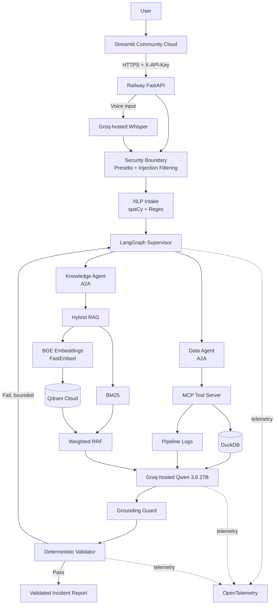

# DataOps Sentinel AI

**Autonomous Multi-Agent Data & BI Incident Investigation Platform**

DataOps Sentinel AI is a production-style AI engineering project for investigating data-pipeline and BI incidents using a distributed, evidence-grounded multi-agent architecture.

A user can report an incident in text or voice — for example:

> "Our executive Sales KPI dashboard dropped significantly today. Investigate what happened and recommend what we should do."

The system sanitizes the request, classifies the incident, delegates evidence collection to specialist agents, retrieves operational knowledge, synthesizes a root-cause analysis with Qwen, and deterministically validates critical facts before accepting the result.

**Live hosted demo:** [dataops-sentinel-ai.streamlit.app](https://dataops-sentinel-ai-assistant.streamlit.app/)

---

## Highlights

- **LangGraph** for stateful orchestration, parallel fan-out/fan-in, bounded retry, and validation routing
- **A2A** for communication with independently deployed specialist agents
- **MCP** for standardized read-only access to database and pipeline-log tools
- **Hybrid RAG** using BGE embeddings + BM25 + weighted Reciprocal Rank Fusion
- **Qdrant Cloud** for managed vector search in the hosted profile
- **Groq-hosted Qwen 3.6 27B** for managed cloud root-cause synthesis
- **Qwen3 4B via Ollama** retained as the local development/runtime profile
- **Deterministic grounding and validation** instead of LLM self-reported confidence
- **Presidio** for PII detection/anonymization
- **spaCy + regex** for deterministic NLP routing and technical-entity extraction
- **Groq-hosted Whisper** for cloud speech-to-text and **faster-whisper** for local speech-to-text
- **OpenTelemetry** for per-node latency and execution tracing
- **FastAPI** as the public orchestration API
- **Streamlit Community Cloud** as the hosted UI
- **Railway private networking** for MCP and both A2A specialist services
- **Docker Compose** for reproducible local deployment
- **Pytest + GitHub Actions** for automated quality checks
- **Graceful degradation** when remote specialist services are unavailable

---

## Fully Hosted Architecture

The primary public deployment no longer depends on a developer laptop being online.



### Hosted service topology

| Service | Hosting | Public? | Responsibility |
|---|---|---:|---|
| Streamlit UI | Streamlit Community Cloud | Yes | User interface |
| `sentinel-api` | Railway | Yes | FastAPI + LangGraph + security + LLM/STT provider access |
| `sentinel-data-agent` | Railway | No | A2A data specialist |
| `sentinel-knowledge-agent` | Railway | No | A2A hybrid-RAG specialist |
| `sentinel-mcp` | Railway | No | MCP read-only DuckDB/log tools |
| Vector store | Qdrant Cloud | Managed HTTPS | Dense retrieval |
| LLM / STT | Groq | Managed HTTPS | Qwen synthesis + Whisper transcription |

Only the Streamlit UI and FastAPI entrypoint are publicly reachable. MCP and both A2A services remain inside Railway's private network.

---

## Local Development Architecture

The original local profile is intentionally preserved for reproducibility and offline development:

```text
Streamlit
   ↓
FastAPI → LangGraph
   ├─ A2A → MCP → DuckDB / logs
   └─ A2A → Hybrid RAG → Qdrant
                    ↓
                Ollama
              Qwen3 4B
                    ↓
          Grounding + Validator
```

Local defaults:

- Qwen3 4B via Ollama
- Qdrant standalone/local storage
- BGE through sentence-transformers
- faster-whisper on CPU
- Docker Compose service isolation

Provider switching is controlled through environment variables, so the orchestration and validation layers remain the same across local and cloud profiles.

---

## Demo Incident

The synthetic enterprise dataset contains a controlled DataOps incident:

- Previous loaded rows: **13,521**
- Expected rows: **13,521**
- Loaded rows: **9,843**
- Rejected rows: **3,678**
- Root cause: `employee_id` becomes `NULL` during the employee-mapping transformation
- Downstream effect: the Sales KPI dashboard drops because the warehouse receives fewer valid rows

The system must correlate database evidence, ETL logs, and retrieved operational knowledge before the validator can accept the conclusion.

---

## Evaluation

### Local production regression baseline

The local Docker/Ollama production path was evaluated through:

`FastAPI → LangGraph → A2A → MCP/RAG → Qwen3 4B → Validator`

Results on the current **8-case regression suite**:

| Metric | Result |
|---|---:|
| Routing accuracy | **100%** |
| Fact accuracy | **100%** |
| Retrieval hit rate | **100%** |
| Citation validity | **100%** |
| Validation pass rate | **100%** |
| Security-control accuracy | **100%** |
| PII leak rate | **0%** |
| Average end-to-end latency | **18.45 s** |
| P95 latency | **28.14 s** |

The suite contains normal incident paraphrases plus PII, prompt-injection, and out-of-scope scenarios. These results describe the current regression dataset only; they are not a claim of universal model accuracy.

Run the local regression suite with:

```powershell
python scripts/evaluate_phase5.py
```

### Hosted cloud smoke test

A fully hosted end-to-end smoke test was also completed through:

`Streamlit/Railway API → LangGraph → A2A → MCP/RAG → Qdrant Cloud → Groq Qwen → Validator`

Canonical hosted incident result:

| Check | Result |
|---|---:|
| Groq/Qwen synthesis | **PASS** |
| Critical rejected-row fact preserved | **PASS** |
| `employee_id` NULL fact preserved | **PASS** |
| Retrieved citations valid | **PASS** |
| Deterministic validation checks | **8 / 8 PASS** |
| Validation result | **True** |
| Qwen synthesis node | **~1.64 s** |
| End-to-end latency | **~4.70 s** |

This is a **single hosted smoke-test scenario**, not the complete 8-case cloud regression suite. The local and cloud metrics are intentionally reported separately until the full cloud suite is rerun.

---

## Performance Findings

### Local Qwen benchmark

Per-node tracing identified local LLM inference as the dominant latency source.

| Model | Context | Avg. isolated latency | Critical facts preserved |
|---|---:|---:|---:|
| Qwen3 4B | 4096 | ~19.13 s | Yes |
| Qwen3 4B | 8192 | ~130.91 s | Yes |

The local profile therefore uses:

```env
OLLAMA_MODEL=qwen3:4b
OLLAMA_NUM_CTX=4096
RAG_TOP_K=3
```

Both context sizes preserved the required facts, but 4096 provided dramatically lower latency.

### Hosted inference

The hosted smoke test moved the major inference workload from local CPU Ollama to Groq-hosted Qwen. In that canonical run, the Qwen RCA node completed in roughly **1.64 seconds** and the entire investigation completed in roughly **4.70 seconds**.

---

## Technology Stack

| Layer | Hosted profile | Local profile |
|---|---|---|
| UI | Streamlit Community Cloud | Streamlit |
| API | Railway FastAPI | FastAPI |
| Workflow orchestration | LangGraph | LangGraph |
| Agent interoperability | A2A | A2A |
| Tool interoperability | MCP | MCP |
| LLM | Groq-hosted Qwen 3.6 27B | Qwen3 4B |
| LLM runtime | Groq | Ollama |
| Embeddings | BAAI/bge-small-en-v1.5 | BAAI/bge-small-en-v1.5 |
| Embedding runtime | FastEmbed | sentence-transformers |
| Dense vector search | Qdrant Cloud | Qdrant standalone/local |
| Lexical retrieval | BM25 | BM25 |
| Rank fusion | Weighted Reciprocal Rank Fusion | Weighted Reciprocal Rank Fusion |
| Operational database | DuckDB | DuckDB |
| NLP | spaCy + regex | spaCy + regex |
| PII protection | Microsoft Presidio | Microsoft Presidio |
| Speech recognition | Groq-hosted Whisper | faster-whisper |
| Observability | OpenTelemetry | OpenTelemetry |
| Service hosting | Railway | Docker Compose |
| Testing | pytest | pytest |
| CI | GitHub Actions | GitHub Actions |

---

## Hallucination Controls

The project does not rely on a single prompt such as "do not hallucinate."

Controls include:

1. Evidence-only root-cause synthesis
2. JSON/Pydantic application-schema validation
3. Retrieval-source allowlisting for citations
4. Evidence-critical grounding invariants
5. Deterministic numeric and identifier validation
6. Critical checks that cannot be overridden by a high average score
7. Bounded validation retry
8. Read-only MCP tools
9. Out-of-scope routing
10. PII sanitization before graph state is created
11. Deterministic fallback when the configured LLM is unavailable or invalid

The LLM does **not** assign its own confidence score. Confidence is calculated by the application from independently verifiable evidence conditions.

---

## Security & Privacy

Before user input enters LangGraph state:

- Presidio detects and anonymizes sensitive entities
- Prompt-injection patterns are flagged and filtered
- NLP scope controls prevent unrelated prompts from activating enterprise investigation tools
- MCP tools are read-only
- Raw PII is not intentionally propagated into A2A, MCP, RAG, or LLM prompts

Hosted deployment adds another boundary:

- Streamlit stores only `API_BASE_URL` and a shared `API_KEY` in its secrets configuration
- FastAPI protects investigation, dependency-health, privacy-preview, and transcription routes using `X-API-Key`
- Groq and Qdrant credentials remain server-side in Railway variables
- MCP and both A2A specialist agents are not exposed through public Railway domains
- Qdrant Cloud is accessed over its managed authenticated HTTPS API

---

## Graceful Degradation

A specialist-agent failure does not automatically crash the investigation.

The graph records service availability, continues with evidence that is still reachable, and prevents insufficiently supported conclusions from being accepted as fully validated.

For local testing:

```powershell
docker compose -f compose.host-ollama.yaml stop knowledge-agent
```

Restart it with:

```powershell
docker compose -f compose.host-ollama.yaml start knowledge-agent
```

---

## Repository Structure

```text
DataOps-Sentinel-AI/
├── api/
├── services/
├── src/
│   └── sentinel/
│       ├── agents/
│       ├── protocols/
│       ├── rag/
│       └── tools/
├── streamlit_cloud/
│   ├── app.py
│   └── requirements.txt
├── deploy/
│   └── railway/
│       ├── Dockerfile.api
│       ├── Dockerfile.mcp
│       ├── Dockerfile.data-agent
│       ├── Dockerfile.knowledge-agent
│       └── requirements-*.txt
├── scripts/
├── tests/
├── evals/
├── data/
├── .github/workflows/
├── app.py
├── Dockerfile
├── compose.yaml
├── compose.host-ollama.yaml
├── compose.demo.yaml
├── CLOUD_DEPLOYMENT.md
├── DEPLOYMENT.md
├── requirements.txt
└── README.md
```

---

## Hosted Deployment

The hosted deployment uses two public entrypoints:

1. **Streamlit Community Cloud** — user-facing UI
2. **Railway `sentinel-api`** — authenticated FastAPI backend

Three Railway backend services remain private:

```text
sentinel-api
   ↓ private Railway network
   ├─ sentinel-data-agent
   ├─ sentinel-knowledge-agent
   └─ sentinel-mcp
```

The Streamlit app is deployed from:

```text
streamlit_cloud/app.py
```

Its secrets contain only:

```toml
API_BASE_URL = "https://<railway-api-domain>"
API_KEY = "<shared-api-key>"
```

The Railway API holds the Groq and Qdrant credentials. No provider secrets are committed to GitHub or exposed to the browser.

See [`CLOUD_DEPLOYMENT.md`](CLOUD_DEPLOYMENT.md) for the full service-by-service deployment flow.

---

## Local Quick Start — Windows + Host Ollama

### Prerequisites

- Python 3.12
- Docker Desktop
- Ollama

Pull the local model:

```powershell
ollama pull qwen3:4b
```

Start the complete stack while reusing Windows Ollama:

```powershell
docker compose -f compose.host-ollama.yaml up -d --build
```

Check service health:

```powershell
docker compose -f compose.host-ollama.yaml ps
```

Local endpoints:

- Streamlit: `http://localhost:8501`
- FastAPI Swagger: `http://localhost:8000/docs`
- Dependency health: `http://localhost:8000/health/dependencies`
- Qdrant dashboard: `http://localhost:6333/dashboard`

Run the production smoke test:

```powershell
python scripts/smoke_test_stack.py
```

Expected:

```text
Production stack smoke test PASSED
```

---

## Automated Tests

Unit tests do not require live A2A/MCP/Ollama infrastructure:

```powershell
pytest -m "not integration" -v
```

Current local result:

```text
8 passed, 1 deselected
```

The end-to-end demo test is explicitly marked as an integration test.

---

## Optional Local Public Tunnel

Cloudflare Quick Tunnel is retained only as an optional local/demo path. It is no longer the primary hosted deployment.

```powershell
docker compose `
  -f compose.host-ollama.yaml `
  -f compose.demo.yaml `
  up -d tunnel
```

Then retrieve the temporary URL:

```powershell
docker compose `
  -f compose.host-ollama.yaml `
  -f compose.demo.yaml `
  logs tunnel
```

See [`DEPLOYMENT.md`](DEPLOYMENT.md).

---

## Design Principle

The project separates responsibilities deliberately:

- **LangGraph** controls workflow, state, branching, fan-out/fan-in, and bounded retry.
- **A2A** connects independently deployed specialist agents.
- **MCP** standardizes read-only agent access to tools and operational evidence.
- **Hybrid RAG** retrieves external operational knowledge.
- **Qwen** synthesizes the evidence into a root-cause report.
- **The grounding guard** protects evidence-critical identifiers and numbers.
- **The deterministic validator** decides whether the conclusion is trustworthy enough to accept.

The LLM is therefore one reasoning component inside a larger evidence collection, orchestration, security, grounding, and validation system — not the system itself.

---

## License

MIT
